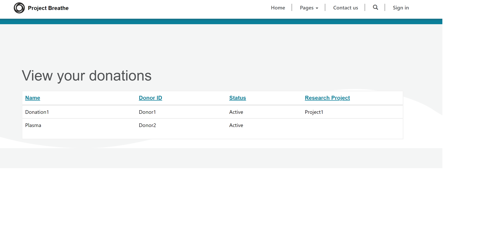

# Overview

This document covers spike for frontend for two pages using PowerApps

1. Donation View
1. Donation entry by medical officer

## Assumptions

1. Donations and research project data available in Dataverse.
1. Not considering PII data in this spike.
1. Anonymous access allowed for both pages

## Features explored

We used powerapps portal for this spike which is used to create external-facing websites that allow users outside their organizations to sign in with a wide variety of identities, create and view data in Microsoft Dataverse, or even browse content anonymously.

Portal app is created with two pages

1. Donation View  
Power apps list was used to display the contents from dataverse table.  

1. Medical officer donation entry page.  
Power apps forms were used to enter donation data.

## Further Investigations

1. Further entity design needs to be done.
1. Donation entry must be allowed only for authenticated users.
1. Record level security must be implemented for donors to view only their donations.
1. Based on complexity we can also explore PowerBI to generate report.
